## Cafeteria - Coffee House
Um site responsivo e moderno para a Cafeteria & Bistrô Serenatto, oferecendo uma experiência agradável para os amantes do café.

## Tecnologias Utilizadas

HTML5: Estruturação da página.
CSS: Estilização com um foco em design responsivo.
Bootstrap 5: Framework CSS para componentes responsivos e interativos.
JavaScript: Para interatividade adicional (ex. modais).

## Funcionalidades
Navegação Intuitiva: Menu de navegação com acesso rápido às seções principais do site.
Seções Destacadas: Informações sobre serviços e produtos, incluindo cafés, bistrôs e opções de delivery.
Modo Noturno: Alternativa de visualização para maior conforto.
Formulário de Contato: Permite que os usuários enviem suas informações e feedback diretamente pelo site.

## Clone o repositório:
git clone https://github.com/AndressaTurchetto/coffe-shop-with-bootstrap.git

## Contribuição
Contribuições são bem-vindas! Se você tiver sugestões ou melhorias, sinta-se à vontade para abrir uma issue ou enviar um pull request.

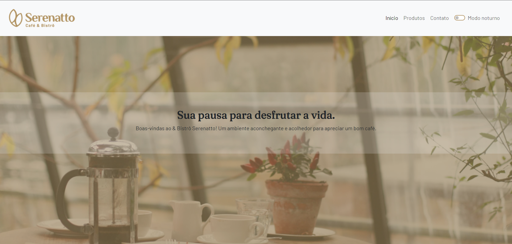
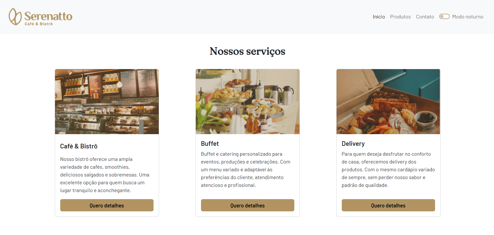
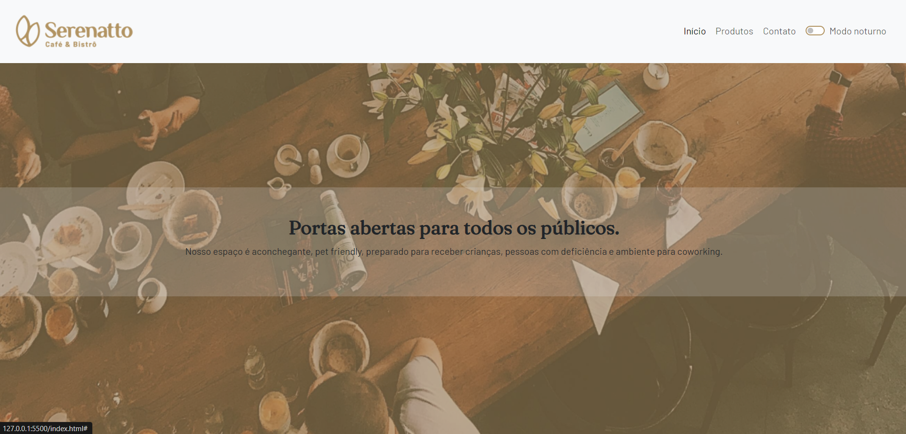
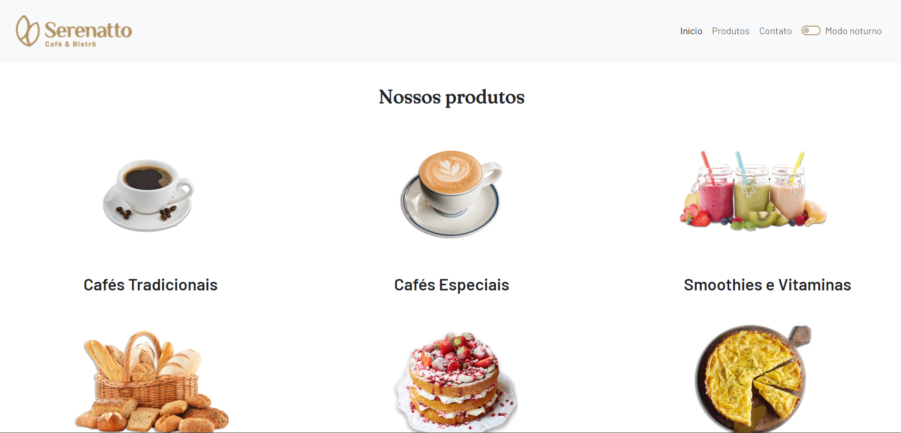
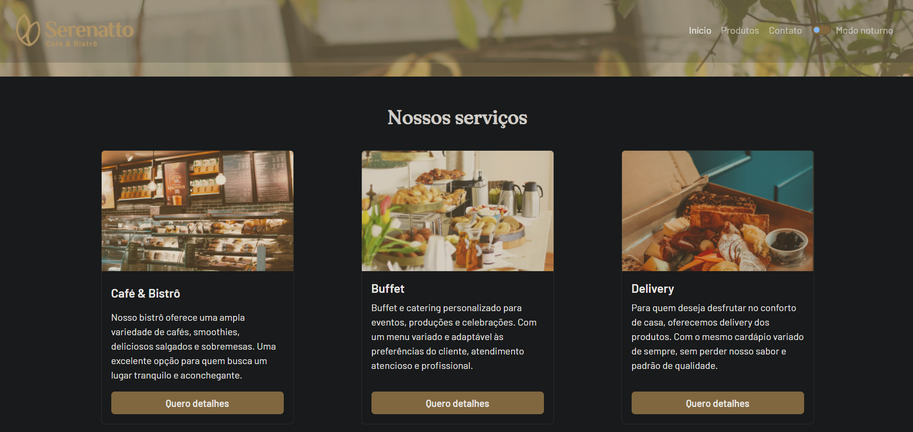
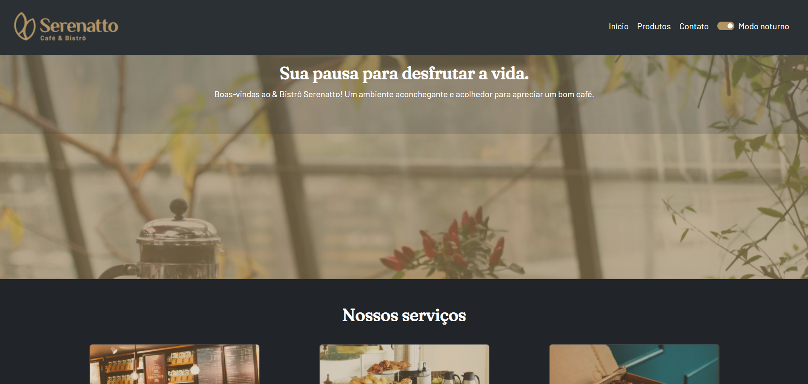
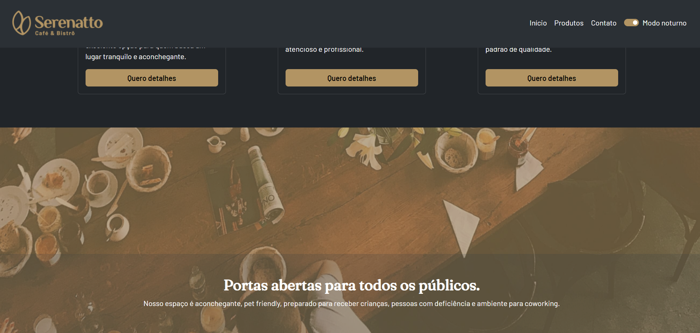
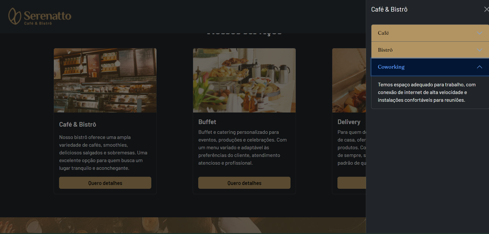
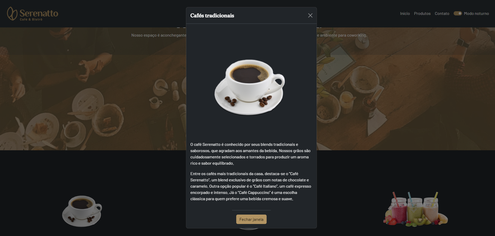
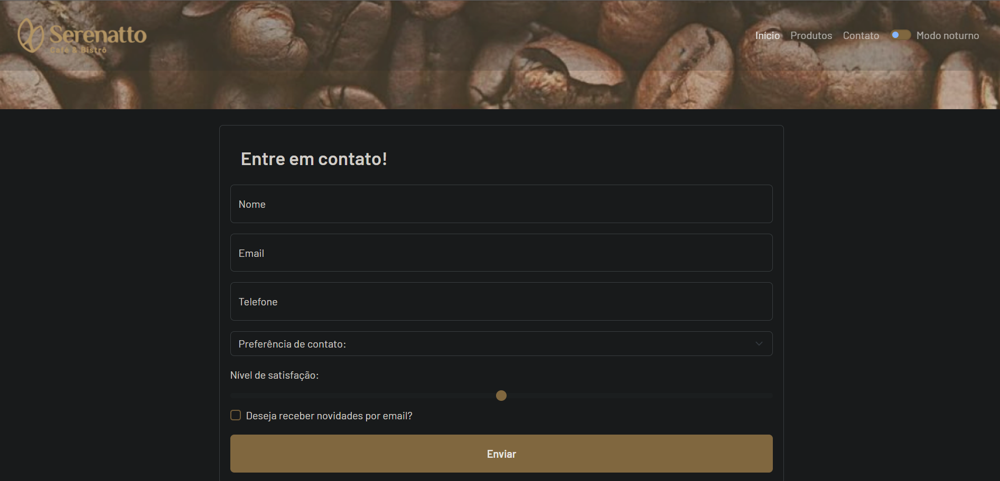

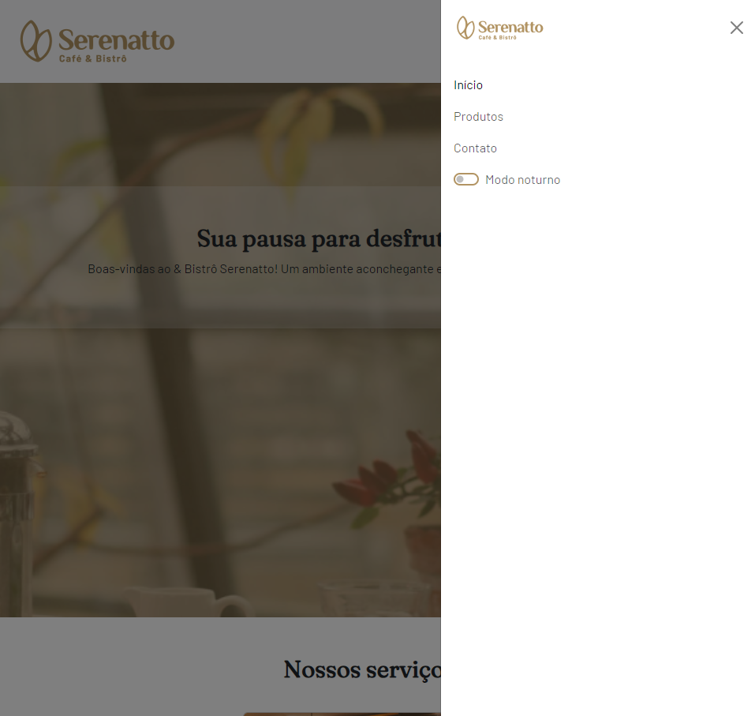
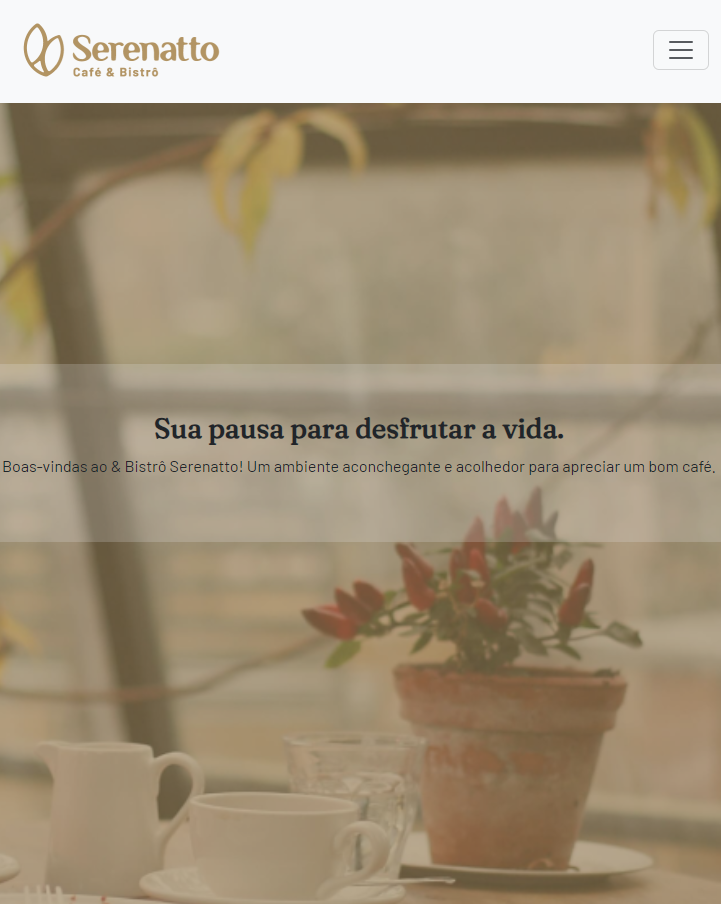
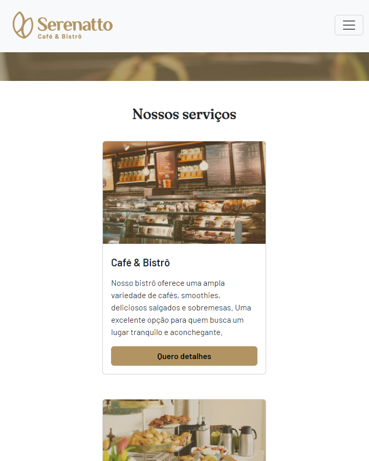
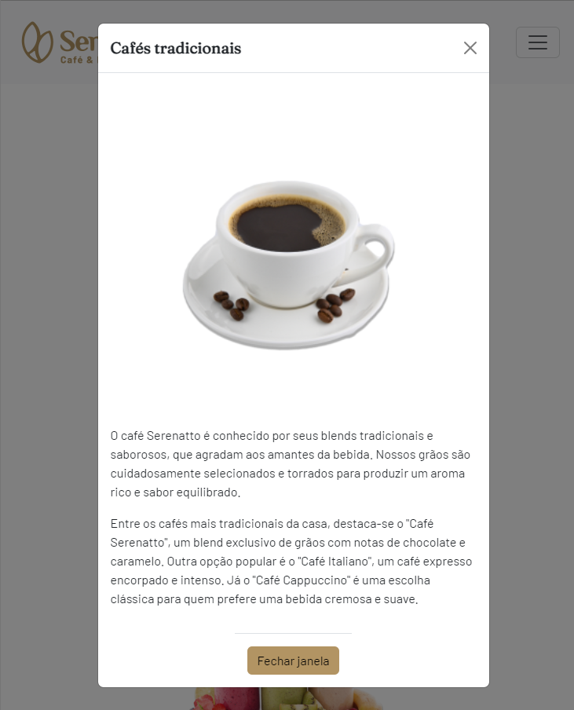
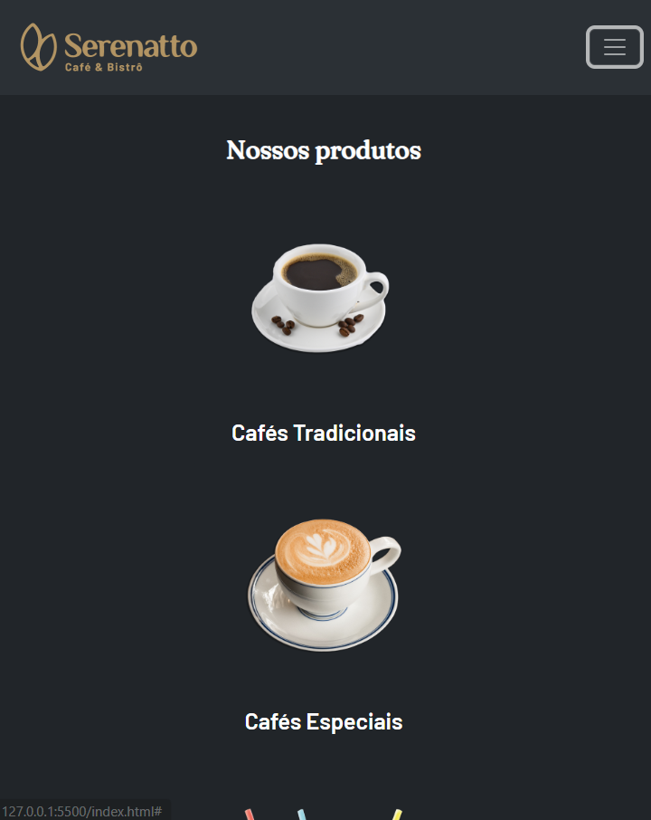
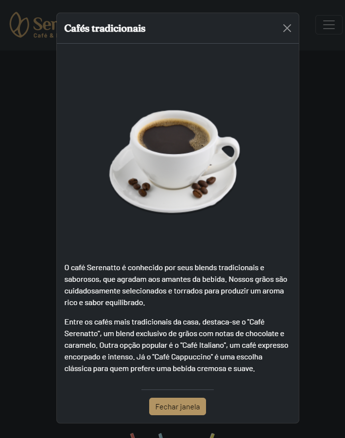

